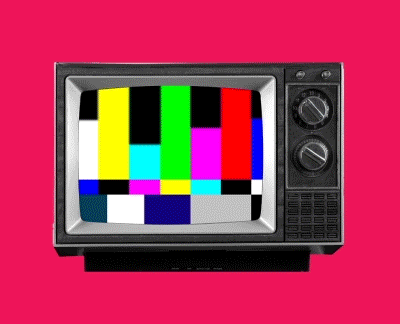

<div align="center">

<br />

<h1>COLORS WORLD</h1>

<p><strong>A creative studio for colour and brand — where 16.7 million colours are a place you explore, and your dashboard is your studio wall.</strong></p>

<p>
  <a href="https://colors-world.vercel.app"></a>
  <a href="https://github.com/aardevaas/Colors-World/stargazers"></a>
  <a href="./src/lib/color-engine/LICENSE"></a>
</p>

<p><em>No sign-up. No paywall. Open the link and start.</em></p>

<br />



<br />
<br />

</div>

---

## The thing that makes this different

Most colour tools ship a **list** of colours. Colors World doesn't have one.

All **16,777,216** colours are **computed arithmetically** from their index — there is no 16.7M-row table, no pagination, no "load more". A colour's position *is* its definition, so you can jump anywhere in the space instantly and it renders the same colour every time, on every device.

That engine underneath is the real work, and it is the part you can take:

| | |
|---|---|
| **OKLCH throughout** | Perceptually uniform. Lightness means lightness. |
| **WCAG 2.1 + APCA** | Both contrast models, including APCA's polarity-dependent maths |
| **Gamut mapping** | sRGB · Display P3 · Rec. 2020, plus a print-safe CMYK check |
| **CVD simulation** | Protanopia, deuteranopia, tritanopia, achromatopsia |
| **Perceptual distance** | ΔE in OKLab, not the RGB euclidean distance most tools use |
| **95 tests** | On the engine alone. 503 across the project. |

**The colour engine is MIT licensed** — commercial use included. See [licensing](#licensing).

---

## 💌 A letter from the founder

> *"Every time I kick off a new branding or web project, I find myself opening 10 different browser tabs — one for picking swatches, another for building color scales, a third for extracting colors from reference photos, one to test UI contrast, and yet another just to pair typography.*
>
> *It was fragmented, clunky, and exhausting. It pulled me out of my creative flow every single time.*
>
> *The community has given me the foundation for almost everything I've ever built. I reached a point where I wanted to stop complaining about broken design workflows and build the studio I always dreamed existed — an all-in-one, beautifully visual workspace — and hand it straight back to creators.*
>
> *No paywalls. No subscriptions. No ads. Just raw creative freedom."*
>
> **— aardevaas**

---

## The studio, tab by tab

Colors World is five workspaces that share one colour engine and one collector dock. **Three are live today; two are in active development.** Each tab has its own typographic and atmospheric identity — the shell stays constant, the world inside it changes.

### ✅ 01 · Library — `/library`
Wander a continuous, infinite field of every colour there is.
- **Vibe search** — type a mood (*"ocean at dusk"*, *"1970s Italian cafe"*) and get a genuinely varied palette back, not twelve near-identical hexes
- **Colour genetics** — open any colour to see its family, harmonies, and perceptual neighbours
- **Harmonic Dock** — collect as you browse; the dock follows you across every tab

### ✅ 02 · Builder — `/builder`
Turn one anchor colour into a complete, production-ready scale.
- **Curve manipulation** — shape lightness, chroma and hue torsion independently across the ramp
- **Contrast matrix** — every step against every other, WCAG and APCA, directional
- **Export vault** — CSS variables, Tailwind v4 `@theme`, shadcn tokens, JSON. Honest about the tokens it *can't* derive rather than inventing plausible ones.

### ✅ 03 · Studio — `/studio`
An infinite spatial canvas where a brand actually comes together.
- **Real pan and zoom** — zoom-to-cursor, rubber-banded bounds, minimap, fly-to
- **Drop an image** → its palette extracts automatically (k-means clustered in OKLab, so perceptually distinct colours don't get merged)
- **Bento snapping** and editorial palette docking along an image's edge
- **Ambient radiance** — colour cards glow in their own hue
- **Export a watermarked PNG** of the whole board, at world-natural resolution

### 🚧 04 · Visualizer — `/visualizer`
*In development.* Test palettes on real UI templates, audit contrast live, auto-fix failures while preserving hue, and export Tailwind/shadcn code.

### 🚧 05 · Typography — `/typography`
*In development.* Pair type with colour, scan your local system fonts via `queryLocalFonts()`, drive variable-font axes, and generate fluid `clamp()` scales.

---

## Screenshots

> **Contributors welcome here** — the fastest way to help right now is a good screen recording. See [issue: add product media](https://github.com/aardevaas/Colors-World/issues).

<!--
  TODO — replace with real captures, placed in docs/assets/:
    docs/assets/studio.png   — /studio with a populated board (glow + minimap visible)
    docs/assets/library.png  — /library mid-scroll
    docs/assets/builder.png  — /builder with a curve + contrast matrix open
    docs/assets/demo.gif     — 8-12s: drop an image → palette extracts → auto-format
-->

---

## Tech

**Next.js 15** (App Router, RSC) · **TypeScript** strict · **Supabase** (Postgres + RLS + Storage) · **React Three Fiber** for the landing globe · **Vitest**

Colour work is pure and isolated in `src/lib/` with unit tests; UI is verified live in a browser before anything is called done. Every dependency is permissively licensed by policy.

```bash
git clone https://github.com/aardevaas/Colors-World.git
cd Colors-World
npm install
cp .env.example .env.local   # add your Supabase keys
npm run dev
```

Database setup lives in `supabase/` — run `schema.sql`, then `storage.sql`, `sharing.sql`, `brand-assets.sql`, then `policies.sql`.

---

## Contributing

This is built in the open and contributions are genuinely wanted.

**Good first contributions right now:**
- 📸 Product screenshots or a demo GIF (see above — highest impact)
- 🎨 UI templates for the Visualizer tab
- ♿ Accessibility fixes — keyboard navigation across the canvas especially
- 🌍 Anything in the MIT colour engine — it's yours to extend

Read [`ROADMAP.md`](./ROADMAP.md) for where this is going and what's honestly unfinished. [`ARCHITECTURE.md`](./ARCHITECTURE.md) explains how it fits together.

**If it's useful to you, star it.** That's what makes other designers find it.

---

## Licensing

This repository is **dual-licensed**, deliberately:

| | |
|---|---|
| **`src/lib/color-engine/**`** | **MIT** — use it anywhere, including commercially |
| **Everything else** | **PolyForm Noncommercial 1.0.0** |

The colour engine is MIT because the maths should belong to everyone — if OKLCH scale generation or APCA contrast is useful in your product, take it, no strings.

The application around it is noncommercial: free to use, study, modify and share, but not to resell or run as a paid service. Commercial licensing enquiries → [aardevaas](https://github.com/aardevaas).

<div align="center">
<br />
<sub>Built by <a href="https://github.com/aardevaas">aardevaas</a></sub>
</div>
