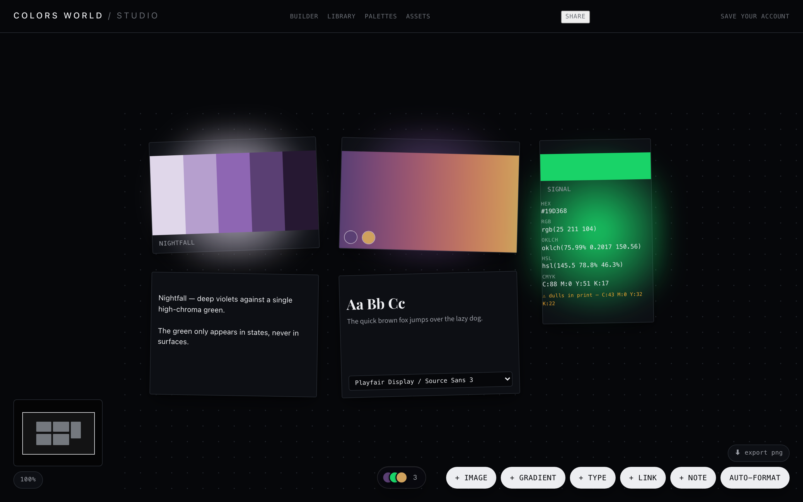
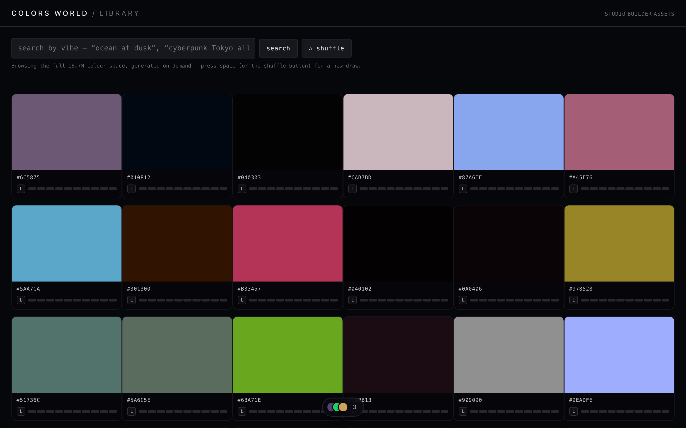
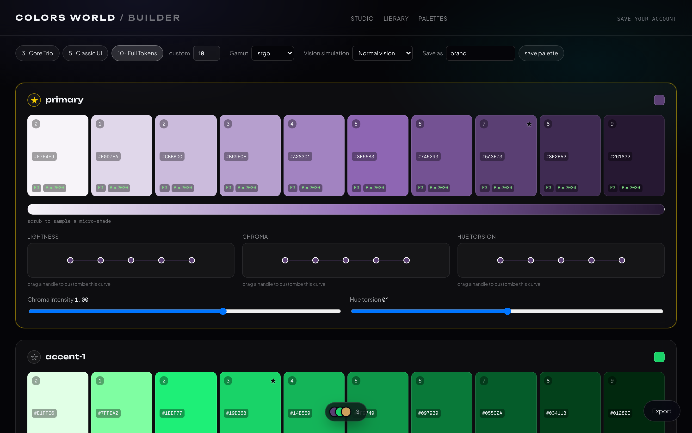

<div align="center">

<br />

<h1>COLORS WORLD</h1>

<p><strong>A creative studio for color and brand — where 16.7 million colors are a place you explore, and your dashboard is your studio wall.</strong></p>

<p>
  <a href="https://colors-world.vercel.app"></a>
  <a href="https://github.com/aardevaas/Colors-World/stargazers"></a>
  <a href="./src/lib/color-engine/LICENSE"></a>
</p>

<p><em>No sign-up. No paywall. Open the link and start.</em></p>

<br />



<sub><em>The Studio — an infinite canvas where a brand comes together.</em></sub>

<br />
<br />

</div>

---

## The thing that makes this different

Most color tools ship a **list** of colors. Colors World doesn't have one.

All **16,777,216** colors are **computed arithmetically** from their index — there is no 16.7M-row table, no pagination, no "load more". A color's position *is* its definition, so you can jump anywhere in the space instantly and it renders the same color every time, on every device.

That engine underneath is the real work, and it is the part you can take:

| | |
|---|---|
| **OKLCH throughout** | Perceptually uniform. Lightness means lightness. |
| **WCAG 2.1 + APCA** | Both contrast models, including APCA's polarity-dependent maths |
| **Gamut mapping** | sRGB · Display P3 · Rec. 2020, plus a print-safe CMYK check |
| **CVD simulation** | Protanopia, deuteranopia, tritanopia, achromatopsia |
| **Perceptual distance** | ΔE in OKLab, not the RGB euclidean distance most tools use |
| **95 tests** | On the engine alone. 503 across the project. |

**The color engine is MIT licensed** — commercial use included. See [licensing](#licensing).

---

## 💌 A letter from the founder

> *"Every time I kick off a new branding or web project, I find myself opening 10 different browser tabs — one for picking swatches, another for building color scales, a third for extracting colors from reference photos, one to test UI contrast, and yet another just to pair typography.*
>
> *It was fragmented, clunky, and exhausting. It pulled me out of my creative flow every single time.*
>
> *The community has given me the foundation for almost everything I've ever built. I reached a point where I wanted to stop complaining about broken design workflows and build the studio I always dreamed existed — an all-in-one, beautifully visual workspace — and hand it straight back to creators.*
>
> *No paywalls. No subscriptions. No ads. Just raw creative freedom."*
>
> **— aardevaas**

---

## The studio, room by room

Colors World is **six workspaces** that share one color engine and one collector dock — **all six are live**. Each room has its own typographic and atmospheric identity: the shell stays constant, the world inside it changes.

They are meant to be walked in order. A color becomes a palette, a palette becomes scales, scales become an interface, an interface gets type, and the whole thing lands on a wall you can arrange.

### 01 · Library — `/library`
Wander a continuous, infinite field of every color there is.
- **Vibe search** — type a mood (*"ocean at dusk"*, *"1970s Italian cafe"*) and get a genuinely varied palette back, not twelve near-identical hexes
- **Color genetics** — open any color to see its family, harmonies, and perceptual neighbours
- **Harmonic Dock** — collect as you browse; the dock follows you across every room

### 02 · Compose — `/compose`
Start from one color, get a whole system.
- **Harmony rules** — monochromatic through square, reconciled against the gamut so a locked color never shifts under you
- **Roll and lock** — the loop the category proved, but constrained to seeds worth building from
- **Contrast as an input, not a dice roll** — declare what the palette must survive and the solver moves the neutral ladder until it does, or names the constraint that blocked it

### 03 · Scales — `/scales`
Turn one anchor color into a complete, production-ready ramp.
- **Curve manipulation** — shape lightness, chroma and hue torsion independently across the ramp
- **Contrast matrix** — every step against every other, WCAG and APCA, directional
- **Export vault** — CSS variables, Tailwind v4 `@theme`, shadcn tokens, JSON. Honest about the tokens it *can't* derive rather than inventing plausible ones.

### 04 · Visualizer — `/visualizer`
Put the palette on real UI and audit it where it actually lives.
- **Four templates** chosen to stress different parts of a palette — dashboard, product card, editorial hero, mobile screen
- **Eleven-pair role audit** — every requirement a standard actually has an opinion about, with the pairs nobody has a rule about marked advisory rather than scored against an invented threshold
- **Auto-fix** that preserves hue, and **color-vision checks** across four types

### 05 · Typography — `/typography`
Pair type with color and find out where it stops being legible.
- **Legibility field** — a grid of size against weight, shaded where the current pair carries text, so a failure reads as a *position with visible ways out* rather than a red number
- **Fluid scales** — eight ratios, live `clamp()` output
- **Local fonts** via `queryLocalFonts()` — $0 hosting, zero copyright exposure

### 06 · Studio — `/studio`
An infinite spatial canvas where a brand actually comes together.
- **Real pan and zoom** — zoom-to-cursor, rubber-banded bounds, minimap, fly-to
- **Drop an image** → its palette extracts automatically (k-means clustered in OKLab, so perceptually distinct colors don't get merged)
- **Bento snapping**, editorial palette docking, and **ambient radiance** — cards glow in their own hue
- **Export a watermarked PNG** of the whole board, at world-natural resolution

---

## Screenshots

**Library** — the full 16.7M-color space, generated on demand.



**Scales** — a ten-step ramp with per-channel curve control and live gamut badges.



> Screenshots are reproducible: `node scripts/capture-screenshots.mjs` drives headless Chrome over CDP and rewrites `docs/assets/`. A short demo GIF is still wanted — see [contributing](#contributing).

---

## Tech

**Next.js 15** (App Router, RSC) · **TypeScript** strict · **Supabase** (Postgres + RLS + Storage) · **Vitest**

The landing page's weather — rain that beads on the buttons, runs the real rounded silhouette, and pours into a pool you can drain — is a hand-written 2D simulation on `<canvas>`, not a 3D library.

Color work is pure and isolated in `src/lib/` with unit tests; UI is verified live in a browser before anything is called done. Every dependency is permissively licensed by policy.

```bash
git clone https://github.com/aardevaas/Colors-World.git
cd Colors-World
npm install
cp .env.example .env.local   # add your Supabase keys
npm run dev
```

Database setup lives in `supabase/` — run `schema.sql`, then `storage.sql`, `sharing.sql`, `brand-assets.sql`, then `policies.sql`.

---

## Contributing

This is built in the open and contributions are genuinely wanted.

**Good first contributions right now:**
- 🎬 A short demo GIF — drop an image, watch the palette extract, hit auto-format
- 🎨 UI templates for the Visualizer tab
- ♿ Accessibility fixes — keyboard navigation across the canvas especially
- 🌍 Anything in the MIT color engine — it's yours to extend

Read [`ROADMAP.md`](./ROADMAP.md) for where this is going and what's honestly unfinished. [`ARCHITECTURE.md`](./ARCHITECTURE.md) explains how it fits together.

**If it's useful to you, star it.** That's what makes other designers find it.

---

## Licensing

This repository is **dual-licensed**, deliberately:

| | |
|---|---|
| **`src/lib/color-engine/**`** | **MIT** — use it anywhere, including commercially |
| **Everything else** | **PolyForm Noncommercial 1.0.0** |

The color engine is MIT because the maths should belong to everyone — if OKLCH scale generation or APCA contrast is useful in your product, take it, no strings.

The application around it is noncommercial: free to use, study, modify and share, but not to resell or run as a paid service. Commercial licensing enquiries → [aardevaas](https://github.com/aardevaas).

<div align="center">
<br />
<sub>Built by <a href="https://github.com/aardevaas">aardevaas</a></sub>
</div>
